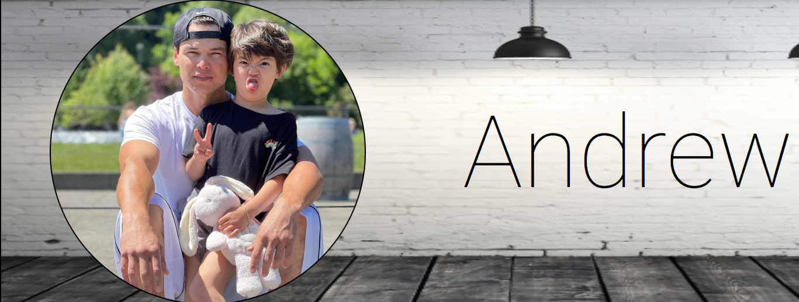

Welcome In!

`React Portfolio`
# Table of Contents

- [Description](#description)
- [Tech Utilized](#tech-utilized)
- [Installation](#installation)
- [How To](#how-to)
- [Mockup](#mockup)
- [App Links](#app-links)
- [Contact](#contact)
- [License](#license)

# Description
   Hello, and welcome to my personal portfolio page. Included are projects assigned while attending the UW Full-Stack development course; in time, this portfolio will be representative of projects completed outside of class so as to exemplify my progress within the computer science field. I hope you enjoy your peruse.

# Tech Utilized

# Installation
- Clone this repository using any method listed below. 
- Navigate to the directory where the repository was cloned.
- Run `npm install` to install all dependencies.

### SSH Key
- `git clone git@github.com:AndyAn7/react-portfolio.git`

### HTTPS
- `https://github.com/AndyAn7/react-portfolio.git`

### GitHubCLI
- `gh repo clone AndyAn7/react-portfolio`

# How To
- Run `npm start` to initialize; application will then open in your default browser..

# Mockup

# App Links
[GitHub Repo](https://github.com/AndyAn7/react-portfolio)
[GitHub Application](https://andyan7.github.io/react-portfolio/)
# Contact
* GitHub: [AndyAn7](https://github.com/AndyAn7)
* email: andyan7@gmail.com
# License
MIT License

Copyright (c) [2022] Andrew An

Permission is hereby granted, free of charge, to any person obtaining a copy
of this software and associated documentation files (the "Software"), to deal
in the Software without restriction, including without limitation the rights
to use, copy, modify, merge, publish, distribute, sublicense, and/or sell
copies of the Software, and to permit persons to whom the Software is
furnished to do so, subject to the following conditions:

The above copyright notice and this permission notice shall be included in all
copies or substantial portions of the Software.

THE SOFTWARE IS PROVIDED "AS IS", WITHOUT WARRANTY OF ANY KIND, EXPRESS OR
IMPLIED, INCLUDING BUT NOT LIMITED TO THE WARRANTIES OF MERCHANTABILITY,
FITNESS FOR A PARTICULAR PURPOSE AND NONINFRINGEMENT. IN NO EVENT SHALL THE
AUTHORS OR COPYRIGHT HOLDERS BE LIABLE FOR ANY CLAIM, DAMAGES OR OTHER
LIABILITY, WHETHER IN AN ACTION OF CONTRACT, TORT OR OTHERWISE, ARISING FROM,
OUT OF OR IN CONNECTION WITH THE SOFTWARE OR THE USE OR OTHER DEALINGS IN THE
SOFTWARE.
___
